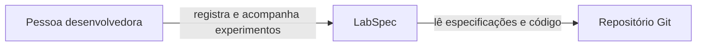
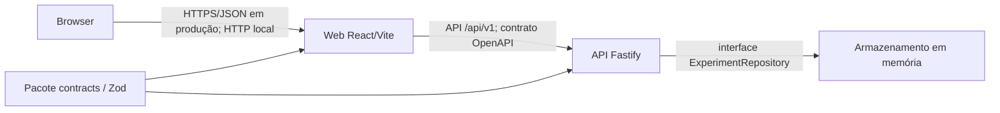

# Arquitetura — C4 (contexto e contêineres)

**Versão:** 1.0.0 | **Estado:** implemented

Os dois primeiros níveis de C4 são suficientes para esta escala.

## Contexto

## Contêineres

## Fronteiras

- Browser → Web/API: entrada não confiável.
- Web → API: CORS não é autorização; todo corpo é validado no servidor.
- API → repositório: interface substituível; domínio não conhece tecnologia de persistência.
- Ambiente → processo: configuração validada na inicialização; segredos nunca usam prefixo `VITE_`.
